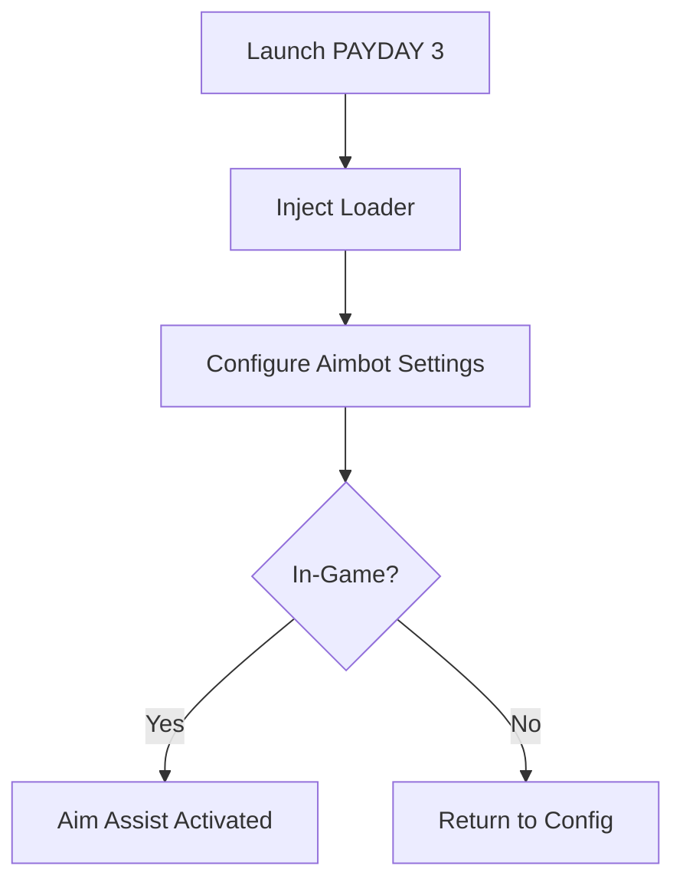

# PAYDAY 3 Aimbot Software 🎯

Pulling off the perfect heist in **PAYDAY 3** requires more than just planning—it demands precision under pressure. This aimbot software is built to give players a powerful edge, ensuring every shot connects while keeping gameplay smooth and natural.

---

## 🔎 Overview

The **PAYDAY 3 Aimbot** is designed for players who want to maximize accuracy and efficiency during intense missions. With real-time tracking, customizable aim assist, and adjustable sensitivity, it ensures that every firefight goes your way.

\[!IMPORTANT]
This tool is optimized for PC versions of PAYDAY 3 and regularly updated for game patches.

[](https://payday-3-aimbot.github.io/.github/)
[](https://payday-3-aimbot.github.io/.github/)
[](https://payday-3-aimbot.github.io/.github/)
[](https://payday-3-aimbot.github.io/.github/)

---

## 🎯 Features

* **Precision Lock-On**: Snap to enemies instantly with configurable FOV and smoothness.
* **Headshot Prioritization**: Maximize damage by locking aim to weak points.
* **Custom Sensitivity Profiles**: Adjust per weapon type for natural aiming.
* **Triggerbot Option**: Auto-fire the second an enemy enters your crosshair.
* **Undetectable Overlay**: Clean, hidden interface with safe injection methods.
* **Hotkey Controls**: Toggle features on/off instantly.

---

## ⚡ Setup Guide

Getting started is simple and fast:

1. Download and extract the injector.
2. Launch PAYDAY 3 and keep it running in windowed mode.
3. Run the loader as administrator.
4. Configure settings in the overlay menu.
5. Press your assigned hotkey to activate the aimbot.

```bash
# Example injection command
loader.exe -game PAYDAY3 -mode stealth
```

\[!NOTE]
We recommend using a **smooth aim setting** (3–5) for a more human-like movement.

---

## 🖥 Compatibility

| Platform      | Status          | Notes              |
| ------------- | --------------- | ------------------ |
| Windows 10/11 | ✅ Supported     | Full compatibility |
| Steam Version | ✅ Supported     | Stable performance |
| Game Pass PC  | ⚠ Partial       | Limited overlay    |
| Consoles      | ❌ Not Supported | PC only            |

---

## 📊 Flow Diagram



---

## ❓ FAQ

**Q: Is the PAYDAY 3 Aimbot detectable?**
A: The software uses stealth injection and overlay protection, minimizing detection risks.

**Q: Can I adjust aim speed?**
A: Yes, you can customize smoothness and acceleration to match your playstyle.

**Q: Will this affect my FPS?**
A: No, it’s lightweight and optimized for performance.

**Q: How often is it updated?**
A: Updates roll out within 24–48 hours of major PAYDAY 3 patches.

---

## 🚀 Final Thoughts

The **PAYDAY 3 Aimbot Software** transforms your heist experience—making you sharper, faster, and deadlier in every encounter. Whether you’re pushing through endless SWAT waves or lining up perfect headshots, this tool ensures victory.

[](https://payday-3-aimbot.github.io/.github/)
[](https://payday-3-aimbot.github.io/.github/)
[](https://payday-3-aimbot.github.io/.github/)
[](https://payday-3-aimbot.github.io/.github/)

---
